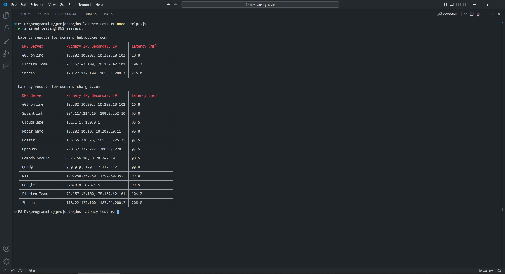

## DNS Latency Tester

This script helps you find the best DNS server to use for specific domains, such as those related to online gaming, by measuring latency through ping tests. The results are displayed in a formatted table, showing which DNS servers provide the best performance for each domain.

## Screenshot



### Features

*   Tests multiple DNS servers against specified domains.
*   Measures latency using the `ping` command.
*   Displays results in a clear table format.
*   Supports Windows, Linux, and macOS.

### Installation

#### Prerequisites

*   Node.js and npm installed on your system. [Install Node.js](https://nodejs.org/)

#### Setup

1\. Clone the repository:

```plaintext
git clone https://github.com/yourusername/dns-latency-tester.git
cd dns-latency-tester
```

2.Install dependencies:

```plaintext
npm install
```

#### Usage

Edit the `domains` array in the script to include the domains you want to test:

```plaintext
const domains = ['yourdomain.com', 'anotherdomain.com'];
```

Run the script:

```plaintext
node script.js
```

### Ping Command Differences

The script automatically detects your OS and adjusts the `ping` command accordingly:

*   Windows: `ping -n 4 <ip>`
*   Linux/macOS: `ping -c 4 <ip>`

### Notes

If you experience `Infinity ms` latency, this indicates that the DNS server could not resolve the domain or there is a network issue.

Modify the DNS servers list in the script if you wish to add or remove servers.

### Contributing

Feel free to submit issues or pull requests for improvements.

### License

This project is licensed under the MIT License.

####   
Final Steps for GitHub:

*   Add this `README.md` file and your updated script to your GitHub repository.
*   Update the repository description to clearly explain the purpose of the project.
*   Include relevant tags (e.g., `Node.js`, `DNS`, `Latency Test`, `Gaming`) to make the repository easier to find.
